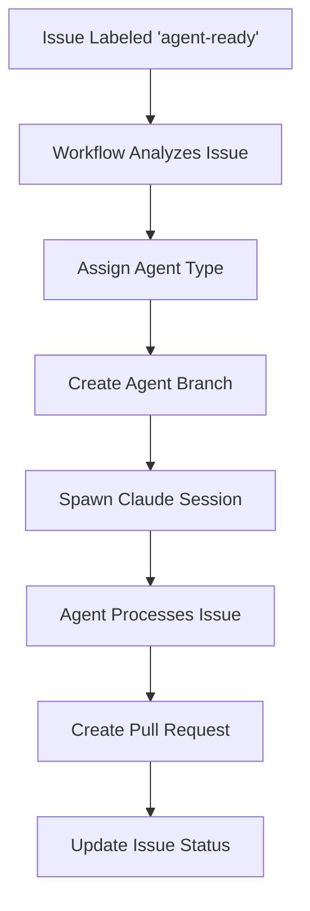

# 🤖 Agent Coordination System

This directory contains the agentic workflow system for parallel issue processing.

## How It Works

1. **Issue Labeling**: Add `agent-ready` label to issues that should be processed by agents
2. **Automatic Dispatch**: GitHub Actions analyzes the issue and assigns appropriate agent type
3. **Branch Creation**: Each agent gets its own branch: `agent/{type}-issue-{number}`
4. **Parallel Processing**: Multiple Claude Code sessions can work simultaneously
5. **PR Creation**: Agents create pull requests when work is complete

## Agent Types

### 🍽️ **menu-refactor**
- **Specializes in:** Input prompts, user interface, menu systems
- **Handles:** Issues with keywords: menu, input, prompt, cleanup, interface
- **Examples:** #18 (reusable input function), #21 (merge prompts), #22 (exit prompts)

### ⚡ **cache-optimizer** 
- **Specializes in:** Performance, caching, optimization
- **Handles:** Issues with keywords: cache, performance, optimization, speed
- **Examples:** #19 (cache invalidation), #20 (two-tier caching)

### 🧪 **test-fixer**
- **Specializes in:** Test suites, test failures, validation
- **Handles:** Issues with keywords: test, fix.*test, expectation, coverage
- **Examples:** #4 (test expectation mismatches)

### 🔧 **general**
- **Specializes in:** General code issues, refactoring, bug fixes
- **Handles:** Any issue not matching other agent specializations

## Usage

### Start Multiple Agents
```bash
# Terminal 1 - Menu refactoring agent
claude-code --session agent-menu-refactor-18

# Terminal 2 - Cache optimization agent  
claude-code --session agent-cache-optimizer-19

# Terminal 3 - Test fixing agent
claude-code --session agent-test-fixer-4
```

### Manual Agent Dispatch
```bash
# Trigger the workflow manually
gh workflow run agent-dispatcher.yml -f issue_numbers="18,19,20" -f agent_type="auto"
```

### Agent Coordination Rules

1. **Branch Isolation**: Each agent works on its own branch to prevent conflicts
2. **Issue Assignment**: Only one agent per issue to avoid duplication
3. **Progress Tracking**: Agents update their instruction files with progress
4. **PR Creation**: Agents create PRs when ready for human review
5. **Conflict Resolution**: Agents check for merge conflicts before creating PRs

### **CRITICAL: Pre-Commit Coordination Protocol**

Every agent MUST follow this before any major commit:

```bash
# 1. Check for main branch updates
git fetch origin main

# 2. Check if rebase is needed
COMMITS_BEHIND=$(git rev-list --count HEAD..origin/main)
if [ "$COMMITS_BEHIND" -gt 0 ]; then
    echo "🔄 Main branch has $COMMITS_BEHIND new commits - rebasing..."
    
    # 3. Rebase against latest main
    git rebase origin/main
    
    # 4. If conflicts, resolve them
    if [ $? -ne 0 ]; then
        echo "⚠️  Conflicts detected - resolve manually then:"
        echo "   git rebase --continue"
        exit 1
    fi
    
    # 5. Re-test after rebase
    echo "✅ Rebase complete - re-testing before commit..."
    # Run tests specific to your agent type
fi

# 6. Only then commit and push
git add .
git commit -m "Your commit message"
git push origin $(git branch --show-current)
```

This ensures **true parallelism with conflict-free integration**.

## Agent Workflow



## File Structure

```
.agents/
├── agent-coordinator.md          # This file
├── agent-{issue}-instructions.md # Per-agent instructions
└── templates/                    # Agent prompt templates
    ├── menu-refactor.md
    ├── cache-optimizer.md
    ├── test-fixer.md
    └── general.md
```

## Benefits

- ✅ **Parallel Development**: Multiple issues processed simultaneously
- ✅ **Specialized Expertise**: Each agent type has domain knowledge
- ✅ **Isolated Work**: Separate branches prevent conflicts
- ✅ **Automated Dispatch**: Issues automatically assigned to appropriate agents
- ✅ **Human Oversight**: All changes require PR review
- ✅ **Progress Tracking**: Full visibility into agent activities

## Getting Started

1. Add `agent-ready` label to issues you want automated
2. The workflow will create agent branches automatically
3. Start Claude Code sessions using the provided commands
4. Agents will work independently and create PRs when done

🤖 **Claude Agent System** - Enabling autonomous, parallel development workflows